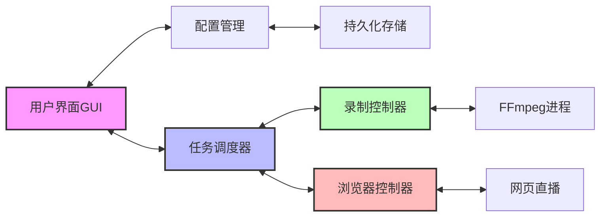
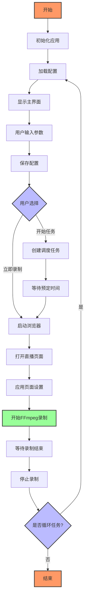

# 网页直播录制工具

## 项目简介

网页直播录制工具是一款专为自动化录制网页直播内容设计的高效应用程序。该工具不仅能够在预设时间自动打开指定网页，还能智能调整窗口和播放器设置，进行高质量的屏幕录制，并在录制完成后自动关闭。

本工具特别适合需要定期录制直播但无法实时操作的用户，如教育工作者、内容创作者、直播分析师等。通过简单的设置，用户可以实现全自动的直播内容采集，无需手动干预，大大提高工作效率。

### 核心优势

- **多平台支持**：完美支持抖音、哔哩哔哩(B站)、斗鱼、虎牙等国内主流直播平台
- **支持虚拟显示器**：可与虚拟显示器工具（如 [Parsec-VDD](https://github.com/nomi-san/parsec-vdd)）配合使用，通过调用外部虚拟显示器实现静默屏幕录制功能，无需物理显示器
- **智能调度系统**：提供灵活的定时和循环任务功能，可按日期、每日或每周特定日期自动执行录制任务
- **高品质视频捕获**：支持多种视频编码和质量选项，确保录制内容的清晰度和流畅度
- **自动化浏览器控制**：能够模拟用户操作，自动处理全屏、取消静音等页面交互

## 主要功能

- **定时录制**：设置未来指定时间自动开始录制，无需人工干预
- **自动化网页操作**：自动打开网页、全屏、取消静音等界面操作
- **高质量视频捕获**：支持多种视频编码格式(H264/H265/VP9/AV1)和质量选项，最高支持4K分辨率
- **多显示器支持**：可以选择在不同显示器上运行和录制，包括通过调用第三方虚拟显示器
- **音频录制**：支持录制系统声音，确保视频内容完整性
- **自定义按键**：可配置自定义按键来适应不同网站的操作特性
- **循环任务**：支持按周期(每天/特定星期几)自动执行录制任务，适合定期直播内容的采集
- **自定义分辨率**：可选择原始窗口分辨率或自定义输出分辨率，满足不同应用场景需求
- **静默模式**：支持在后台运行，不显示浏览器窗口，避免干扰其他工作

## 使用方法

### 基本设置

1. **网页地址**：输入需要录制的直播页面URL（支持抖音、B站等主流直播平台）
2. **开始时间**：设置自动开始录制的时间
3. **录制时长**：设置录制持续的分钟数
4. **保存路径**：选择录制视频的保存位置

### 视频设置

1. **视频格式**：选择输出视频格式（如MP4、MKV等）
2. **视频编码**：选择视频编码方式（H264、H265、VP9等）
3. **分辨率**：选择录制分辨率，可使用原始窗口尺寸或自定义尺寸
4. **帧率**：设置录制的帧率（如15fps、30fps等）
5. **录制质量**：选择录制质量（低、中、高）

### 录制设置

1. **显示器**：选择在哪个显示器上打开和录制直播
2. **音频设备**：选择录制的音频来源
3. **附加选项**：
   - 静默模式：后台运行不显示浏览器窗口
   - 全屏模式：自动使播放器全屏
   - 取消静音：自动取消网页播放器的静音状态
   - 浏览器全屏：启用浏览器的全屏模式
   - 自定义按键：设置自定义按键序列以适应特定网站

### 循环任务

可以设置任务按指定周期自动执行：
- 每天执行
- 特定星期几执行（可多选）

### 操作按钮

- **开始任务**：点击后开始倒计时并在设定时间执行录制
- **立即录制**：立即开始录制而不等待计划时间
- **停止录制**：手动停止当前录制任务

## 开发指南

### 环境准备

1. 安装Python 3.8+
2. 安装Chrome浏览器
3. 安装所需依赖:
   ```
   pip install -r requirements.txt
   ```

### 运行源代码

1. 克隆或下载代码仓库:
   ```
   git clone [repo_url]
   cd webVideo
   ```

2. 运行主程序:
   ```
   python main.py
   ```

### 调试方法

1. **调试GUI界面**:
   ```
   python main.py
   ```
   直接运行程序，通过GUI交互调试

2. **调试录制模块**:
   ```
   python test_monitor.py
   ```
   这个脚本用于测试屏幕捕获和FFmpeg命令生成功能

3. **调试配置文件**:
   - 配置文件保存在用户目录下: `~/config.json`
   - 可以通过直接编辑该文件调试不同配置

4. **日志调试**:
   - 程序运行日志保存在 `logs/` 目录
   - FFmpeg日志保存在录制视频目录的 `ffmpeg.log`

5. **常见调试场景**:
   - 显示器识别问题: 修改 `recorder/ffmpeg_helper.py` 中的 `get_monitor_geometry` 函数
   - 浏览器控制问题: 修改 `browser/browser_controller.py` 中的按键模拟逻辑
   - 定时任务问题: 检查 `scheduler/task_scheduler.py` 中的时间处理逻辑

### 打包应用

1. **使用build.bat打包**:
   ```
   build.bat
   ```
   这将执行以下操作:
   - 清理之前的build和dist目录
   - 使用PyInstaller打包程序为单个可执行文件
   - 包含所有必要的资源和依赖
   - 打包完成后，可执行文件将位于 `dist` 目录中

2. **打包参数说明**:
   - `--onefile`: 将所有文件打包为单个可执行文件
   - `--windowed`: 以窗口模式运行，不显示控制台
   - `--icon`: 设置应用程序图标
   - `--add-data`: 添加非Python文件到包中

3. **自定义打包**:
   如需自定义打包过程，可编辑 `build.bat` 文件，修改PyInstaller的参数

4. **注意事项**:
   - 确保打包前环境中已安装PyInstaller: `pip install pyinstaller`
   - 打包过程需要一定时间，取决于项目大小和计算机性能
   - 打包完成的程序大小较大，因为包含了FFmpeg和Chrome配置

## GUI界面介绍

应用采用现代化的用户界面，主要包含以下元素：

1. **基本设置区**：顶部区域包含网页地址、时间设置等基本参数
2. **视频设置区**：中部区域用于设置视频相关参数
3. **高级选项区**：包含显示器选择、全屏模式等高级设置
4. **定时任务区**：用于设置循环任务的时间表
5. **控制按钮区**：底部区域包含开始/停止按钮以及状态显示
6. **状态显示**：显示当前录制状态、倒计时和操作提示

## 项目目录结构

```
webVideo/
│
├── main.py                 # 程序入口文件
├── requirements.txt        # 项目依赖列表
├── build.bat               # 构建脚本
│
├── assets/                 # 图标和资源文件
│
├── browser/                # 浏览器控制模块
│   ├── browser_controller.py  # 浏览器控制器实现
│   └── clicker.py          # 自动点击功能实现
│
├── config/                 # 配置管理模块
│   ├── config_manager.py   # 配置管理类和函数
│   └── config.json         # 默认配置文件
│
├── ffmpeg/                 # FFmpeg相关文件
│   └── bin/                # FFmpeg可执行文件
│
├── gui/                    # 图形界面模块
│   └── main_window.py      # 主窗口实现
│
├── recorder/               # 录制功能模块
│   ├── recorder.py         # 录制控制实现
│   └── ffmpeg_helper.py    # FFmpeg命令生成和处理
│
├── scheduler/              # 任务调度模块
│   └── task_scheduler.py   # 任务调度器实现
│
├── utils/                  # 工具函数模块
│   └── logger.py           # 日志功能
│
└── videos/                 # 录制视频保存目录
```

## 主要文件功能说明

### 核心文件

1. **main.py**
   - 功能：程序入口文件，初始化日志、配置、调度器和GUI
   - 主要函数：
     - `main()`: 应用程序主入口

2. **gui/main_window.py**
   - 功能：图形界面实现
   - 主要类：`MainWindow`
   - 主要函数：
     - `init_ui()`: 初始化UI组件
     - `on_start_record()`: 开始录制逻辑
     - `on_stop_record()`: 停止录制逻辑
     - `start_countdown()`: 启动倒计时
     - `update_countdown()`: 更新倒计时显示
     - `disable_all_settings()`: 控制界面元素启用/禁用状态

3. **browser/browser_controller.py**
   - 功能：控制浏览器打开网页、调整窗口和发送按键
   - 主要类：`BrowserController`
   - 主要函数：
     - `open_live_page()`: 打开直播页面并进行初始设置
     - `press_key()`: 向网页发送按键操作
     - `close()`: 关闭浏览器

4. **recorder/recorder.py**
   - 功能：控制视频录制的开始和停止
   - 主要类：`Recorder`
   - 主要函数：
     - `start_recording()`: 开始FFmpeg录制
     - `stop_recording()`: 停止录制进程
     - `is_recording()`: 获取当前录制状态

5. **recorder/ffmpeg_helper.py**
   - 功能：生成FFmpeg命令行和处理屏幕捕获相关
   - 主要函数：
     - `generate_ffmpeg_cmd()`: 根据配置生成FFmpeg命令
     - `get_monitor_geometry()`: 获取显示器几何信息
     - `get_ffmpeg_path()`: 获取FFmpeg可执行文件路径

6. **scheduler/task_scheduler.py**
   - 功能：调度录制任务
   - 主要类：`TaskScheduler`
   - 主要函数：
     - `schedule_recording()`: 安排录制任务
     - `schedule_next_recurring()`: 安排下一次循环任务
     - `start_all()`: 启动录制相关组件
     - `stop_all()`: 停止所有组件

7. **config/config_manager.py**
   - 功能：管理应用配置
   - 主要函数：
     - `load_config()`: 加载配置文件
     - `save_config()`: 保存配置文件
     - `get_default_config()`: 获取默认配置

## 数据流转图



## 系统功能流程图



## 技术要点

1. **多线程处理**：使用线程分离UI和录制操作，保证界面响应性
2. **自动化测试**：通过test_monitor.py测试显示器配置和FFmpeg参数
3. **灵活配置**：通过config.json实现可持久化的用户配置
4. **优雅关闭**：确保程序关闭时所有相关进程一并关闭
5. **跨平台兼容**：设计兼容Windows系统环境
6. **资源管理**：合理管理如浏览器配置、临时文件等资源

## 开发环境与依赖

本项目使用Python 3.8+开发，主要依赖以下库：
- PyQt5: 用于构建图形界面
- Selenium: 用于浏览器自动化控制
- APScheduler: 用于任务调度
- FFmpeg: 用于视频捕获和编码
- screeninfo: 用于获取显示器信息

详细依赖列表见requirements.txt文件。 